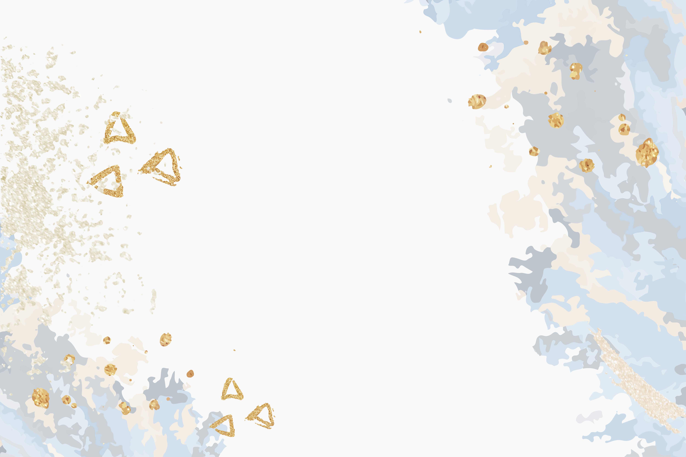

# 🎓 Invitación Web Interactiva de Graduación

¡Bienvenidos al repositorio de la invitación digital de graduación de **Justin Sebastian Pesantes Soto**! Este proyecto fue desarrollado como una alternativa moderna, elegante e interactiva a las invitaciones tradicionales de papel o plantillas estáticas, aplicando conceptos reales de desarrollo frontend, animaciones de alto rendimiento y arquitectura TI.

🚀 **Ver proyecto en producción:** [invitacion-justin.vercel.app](https://invitacion-justin.vercel.app)

---

## 📸 Capturas del Proyecto

| Portada Animada | Sección de la Frase | Detalles y Ubicación |
| :---: | :---: | :---: |
|  | *(Foto del graduado con dedicatoria)* | *(Tarjeta de detalles con Glassmorphism)* |

---

## 🛠️ Tecnologías y Herramientas Utilizadas

El stack tecnológico fue seleccionado estratégicamente para garantizar el máximo rendimiento del lado del cliente, fluidez visual y un flujo de trabajo profesional:

- **[Astro Architecture](https://astro.build/):** Framework web utilizado para generar un HTML estático ultra ligero, ideal para landing pages de alto rendimiento.
- **[GSAP (GreenSock Animation Platform)](https://gsap.com/):** Librería estándar de la industria utilizada para orquestar la línea de tiempo de las animaciones (*timeline*) y las transiciones fluidas de entrada.
- **Intersection Observer API:** API nativa del navegador para detectar el scroll del usuario de forma eficiente y disparar las animaciones en el momento exacto.
- **CSS Avanzado (Flexbox & Glassmorphism):** Estilos modernos adaptables a cualquier dispositivo móvil (*Responsive Design*) con efectos de desenfoque de fondo premium (`backdrop-filter`).
- **Git & GitHub:** Control de versiones utilizando flujos de trabajo profesionales mediante terminal.
- **Vercel Platform:** Hosting en la nube implementando despliegue continuo (CI/CD) conectado directamente al repositorio.

---

## 📂 Estructura Principal del Proyecto

La arquitectura del proyecto sigue las buenas prácticas recomendadas por Astro:

```text
invitacion-justin/
├── public/
│   ├── favicon.png          # Icono personalizado del birrete para la pestaña
│   └── images/
│       ├── fondo-acuarela.jpg   # Textura de fondo del diseño
│       └── foto-hermano.png     # Retrato optimizado del graduado
├── src/
│   └── pages/
│       └── index.astro      # Archivo núcleo (Estructura HTML, Lógica GSAP y Estilos CSS)
├── astro.config.mjs         # Configuración del motor de Astro
├── package.json             # Manifiesto de dependencias del proyecto
└── README.md                # Documentación del sistema